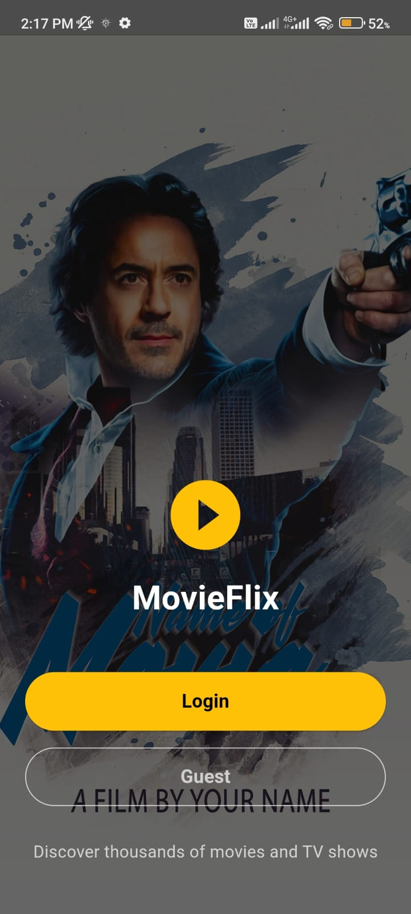
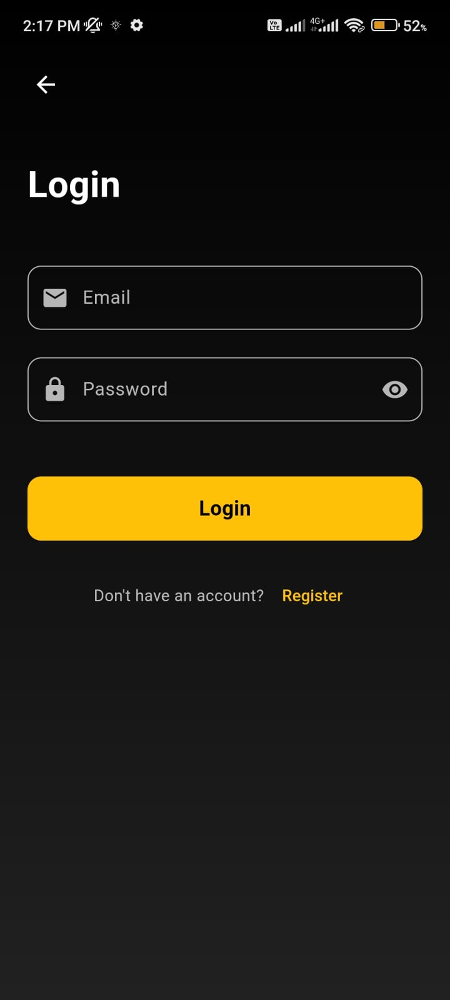
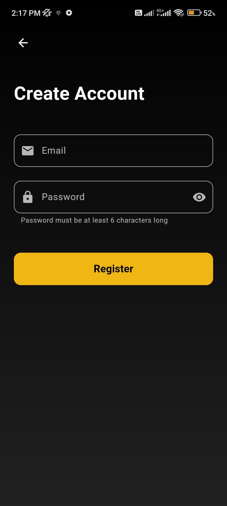
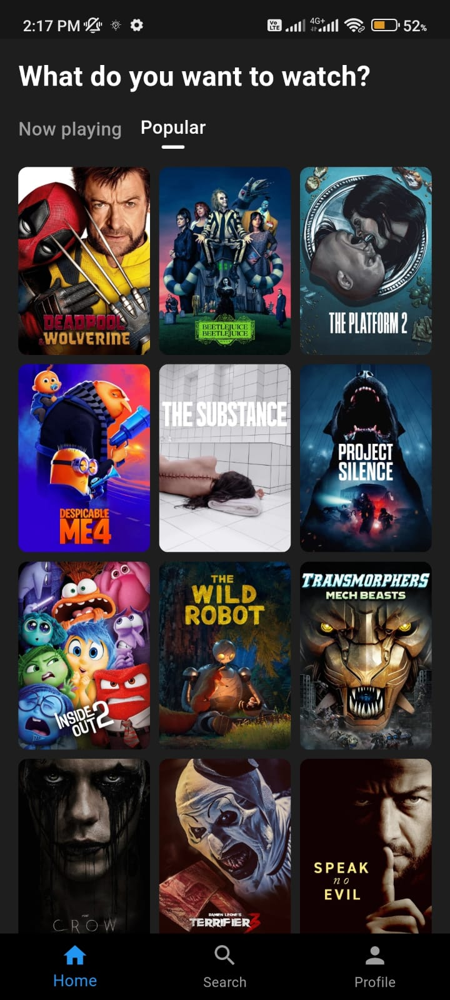
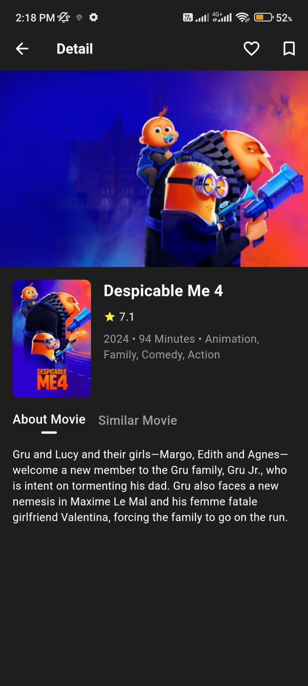
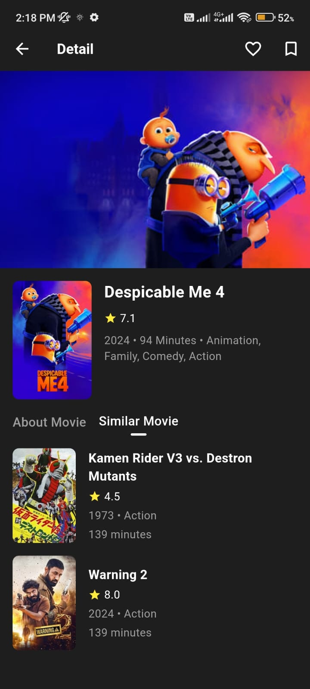
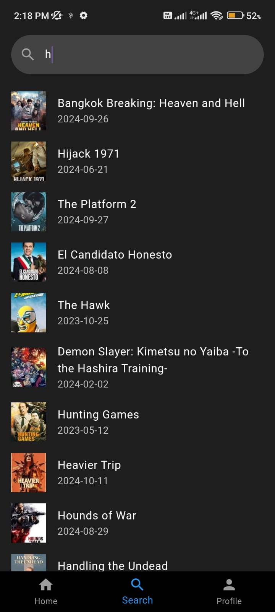
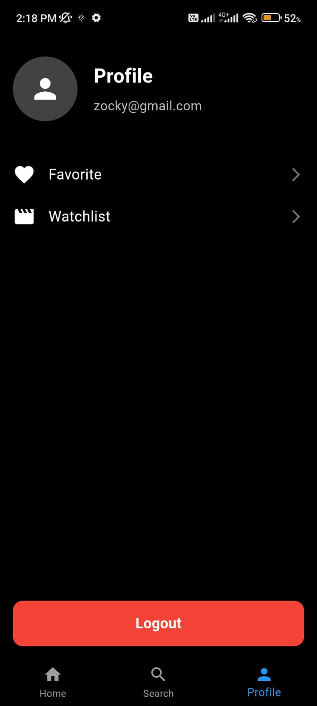
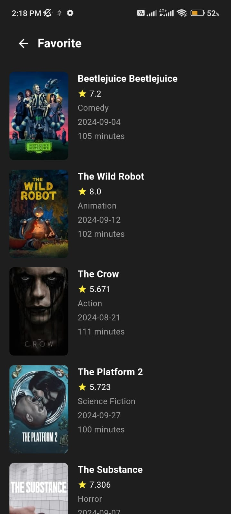

# MovieFlix 🎬

An application that integrates with [TMDB API](https://developer.themoviedb.org/docs/getting-started) and utilizes Firebase for authentication and Firestore for data storage.

## Features 🌟

- **User Profile Screen**:

  - User authentication using Firebase (User/Guest).
  - View Watchlist and Favorite Movies.

- **Home Screen**:

  - Displays \"Now Playing\" movies (limited to 6).
  - Displays \"Popular Movies\" (limited to 20).
  - Buttons to add movies to Watchlist and Favorites.
  - Option to save movie images to local storage.

- **Detail Movie Screen**:
  - View detailed information about selected movies.
  - Display similar movies based on genre.

## Demo 🎥

   
   
   
 
